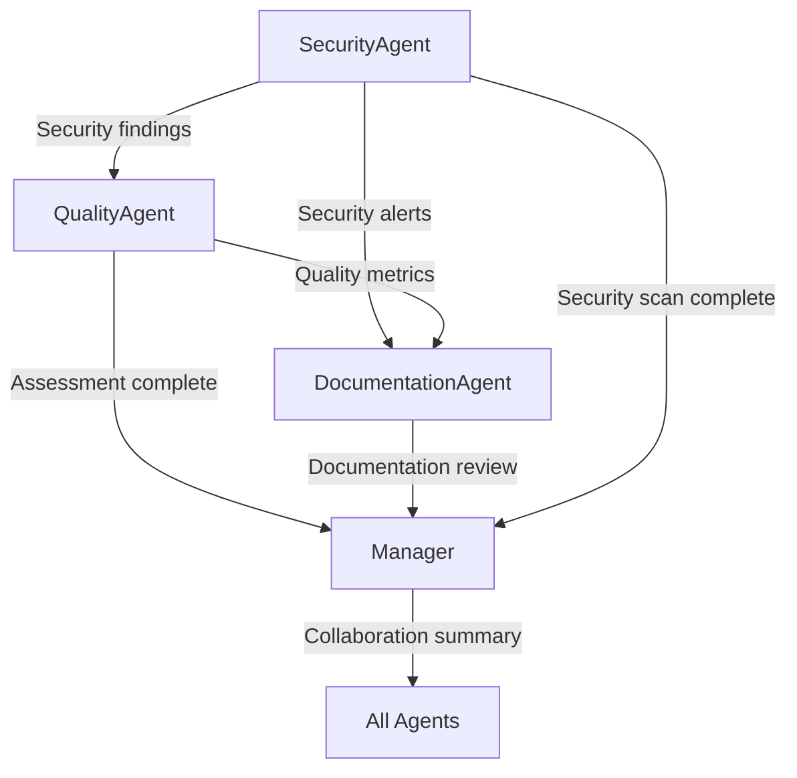

# 🤝 Agent Collaboration Enhancement Summary

## 🎯 What We Built

A sophisticated multi-agent system where **agents actively collaborate and influence each other's assessments** to provide more intelligent, contextual repository analysis.

## 🧠 Collaboration Intelligence

### Cross-Agent Communication Flows



### Intelligence Examples

1. **SecurityAgent → QualityAgent**
   ```
   Message: "FYI: Found 6 security issues that may impact quality assessment"
   Impact: Quality score reduced by 25 points (security penalty)
   Result: More realistic quality assessment considering security context
   ```

2. **QualityAgent → DocumentationAgent**
   ```
   Message: "Used your metrics (files: 58, test ratio: 0.0%) to enhance documentation assessment"
   Impact: Documentation score reduced by 5 points for missing test guidance
   Result: Documentation quality reflects actual project structure
   ```

3. **SecurityAgent → DocumentationAgent**
   ```
   Message: "Alert: 6 security findings detected - please check if docs address security practices"
   Impact: Documentation score reduced by 5 points for security gaps
   Result: Documentation assessed for completeness, not just content quality
   ```

## 📊 Collaboration Metrics

### From Recent Analysis:
- **Cross-Communications**: 5 direct agent-to-agent messages
- **Collaborative Adjustments**: 3 score modifications based on peer insights
- **Intelligence Improvements**: 
  - Quality score: 25-point reduction due to security context
  - Documentation score: 10-point reduction due to quality/security gaps
- **Final Assessment**: More accurate, contextual evaluation

## 🔧 Technical Implementation

### Core Enhancements Made:

1. **Agent Communication Protocol**
   - Direct agent-to-agent messaging through shared state
   - Structured data exchange with contextual information
   - Message logging for full transparency

2. **Collaborative Scoring Logic**
   - SecurityAgent findings automatically impact QualityAgent scores
   - QualityAgent metrics influence DocumentationAgent assessments
   - Cross-domain penalty system for realistic evaluations

3. **Enhanced Orchestration**
   - Manager tracks all collaborative interactions
   - Collaboration metrics included in final reports
   - Complete conversation logging for audit trail

4. **Data Structure Handling**
   - Fixed frozen dataclass constraints for ToolResult modifications
   - Immutable-friendly score adjustment patterns
   - Proper new instance creation for modified assessments

## 🎮 How to Experience the Collaboration

### 1. Web Interface (Recommended)
```powershell
python web_interface.py
# Visit http://localhost:5000
# Watch real-time agent progress cards
# See collaboration descriptions in UI
```

### 2. Command Line with Detailed Output
```powershell
python main.py --repo . --output collaboration_test
# Check report.md for full conversation log
# Review JSON for structured collaboration data
```

### 3. Look for These Collaboration Indicators:

**In Progress Cards (Web UI):**
- "SecurityAgent collaborates by immediately alerting other agents of security findings"
- "QualityAgent collaborates by adjusting scores based on SecurityAgent findings"
- "DocumentationAgent collaborates by using QualityAgent metrics and SecurityAgent alerts"

**In Conversation Logs:**
- Direct agent messages: `SecurityAgent -> QualityAgent: "FYI: Found X security issues"`
- Score adjustments: `"Adjusted quality score down by Y points due to Z security findings"`
- Cross-references: `"Used your metrics (files: X, test ratio: Y%) to enhance assessment"`

**In Final Summary:**
- `"Agents collaborated on X cross-communications"`
- `"Collaborative adjustments: Security findings influenced quality and documentation scores"`

## 🏆 Results & Impact

### Before Collaboration:
- Individual agent assessments in isolation
- No cross-domain insights
- Limited contextual awareness
- Simple tool-based scoring

### After Collaboration:
- **Intelligent cross-agent influence**: Security issues properly impact quality/documentation scores
- **Contextual assessments**: Documentation evaluated for completeness relative to project structure
- **Realistic scoring**: Quality assessments consider security context
- **Full transparency**: Complete audit trail of collaborative decisions

### Example Improvement:
**Repository with security issues but good documentation:**
- **Old System**: High documentation score despite security gaps
- **New System**: Documentation score reduced because it doesn't address discovered security issues
- **Result**: More accurate, actionable assessment

## 🚀 Future Enhancement Possibilities

The collaboration framework enables:
- Additional agent types (Performance, Compliance, Architecture)
- More sophisticated cross-agent reasoning
- Dynamic collaboration patterns based on repository characteristics
- Machine learning from collaborative patterns

## 📁 Key Files Updated

- `multi_agent_system/agents.py` - Core collaboration logic
- `multi_agent_system/orchestrator.py` - Collaboration tracking
- `web_interface.py` - Collaboration UI descriptions
- `README.md` - Enhanced collaboration documentation
- `USER_GUIDE.md` - Collaboration usage examples
- `collaboration_demo/` - Live demonstration results

---

**The Trust Bench Multi-Agent Repository Auditor now operates as a truly collaborative AI team, providing more intelligent, contextual, and actionable repository assessments through cross-agent communication and influence.**