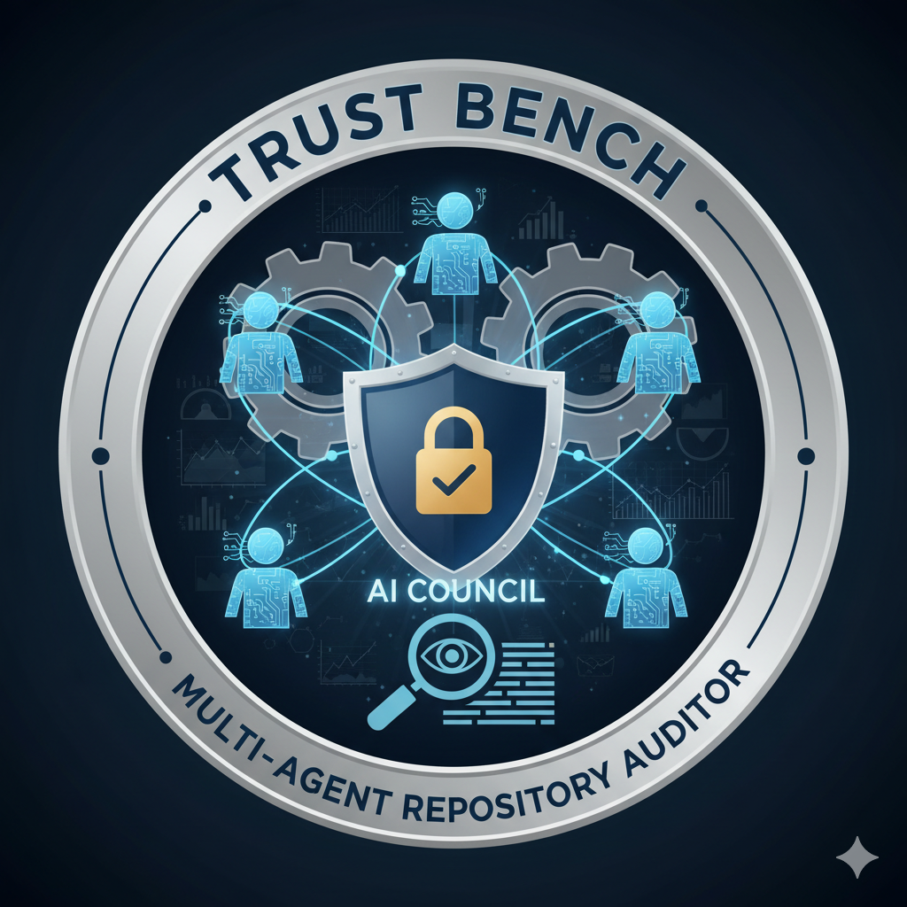

<!-- LKG SHA (preclean): 143d89d4496f8500c38024ec794dae7b20cf522a -->
<p align="center">
  
</p>

# Trust Bench - Multi-Agent Security Evaluation Framework [](#) [](https://1drv.ms/v/c/2c8c41c39e8a63cb/EQil7I1iewdEuzPdQGBqVOYBHaRg9tBcyogZvmKUXKFLyw?e=8Dl8P5)

**Official Publication:** [Trust Bench: Multi-Agent Security Evaluation Framework](https://app.readytensor.ai/publications/trust-bench-multi-agent-security-evaluation-framework-F6PS953ZZuo5)

Trust Bench (Project2v2) is a LangGraph-based multi-agent workflow that inspects software repositories for security leakage, code quality gaps, and documentation health. The system features intelligent agent routing with specialized personas, cross-agent collaboration, transparent reasoning, and reproducible outputs that graders can run entirely offline.

## 🚀 Latest Features

### Phase 1: Intelligent Agent Routing ✅ Complete
- **🛡️ Security Agent**: Specialized vulnerability assessment and risk analysis
- **⚡ Quality Agent**: Code quality improvements and best practices guidance  
- **📚 Documentation Agent**: Documentation generation and improvement suggestions
- **🎯 Orchestrator Agent**: General queries, project overview, and multi-agent coordination
- **Smart Routing**: LLM-powered question classification with confidence scoring
- **Enhanced UI**: Agent personas, visual indicators, and contextual responses

### Phase 2: Multi-Agent Consultation ✅ Complete
- **🔄 Collaborative Analysis**: Complex queries automatically trigger multiple agents
- **🎯 Multi-Agent Detection**: System identifies when specialist consultation is needed
- **📋 Executive Synthesis**: Comprehensive responses combining insights from all relevant agents
- **🤝 Cross-Domain Queries**: Handle requests spanning security, quality, and documentation
- **Visual Collaboration**: UI indicators show when agents are working together
- **Intelligent Orchestration**: Seamless coordination between specialist agents

### Phase 3: Advanced Orchestration ✅ Complete
- **🤝 Consensus Building**: Agents collaborate to reach agreements on complex assessments
- **⚔️ Conflict Resolution**: Systematic resolution of conflicting agent recommendations
- **🔄 Iterative Refinement**: Multiple rounds of analysis for nuanced scenarios
- **⚖️ Priority Negotiation**: Balance competing concerns (e.g., security vs maintainability)
- **🧠 Advanced Synthesis**: Unified recommendations from complex multi-agent negotiations
- **📊 Comprehensive Analysis**: Deep, multi-perspective evaluations with consensus metrics

## Contents
1. [Overview](#overview)
2. [Tool Integrations](#tool-integrations)
3. [Installation & Setup](#installation--setup)
4. [Running the System](#running-the-system)
5. [Evaluation Metrics Instrumentation](#evaluation-metrics-instrumentation)
6. [Reporting Outputs](#reporting-outputs)
7. [Demo Video](#demo-video)
8. [Example Results (Project2v2 self-audit)](#example-results-project2v2-self-audit)
9. [MCP Server (Scope Decision)](#mcp-server-scope-decision)
10. [File Structure (trimmed)](#file-structure-trimmed)
11. [Security & Hardening Notes](#security--hardening-notes)
12. [Credits & References](#credits--references)

---

## Overview

- **Agents**: Manager (plan/finalize), SecurityAgent, QualityAgent, DocumentationAgent  
- **Core Tools**: regex secret scanner, repository structure analyzer, documentation reviewer  
- **Collaboration**: agents exchange messages and adjust scores based on peer findings (security alerts penalize quality/documentation; quality metrics influence documentation, etc.)  
- **Deliverables**: JSON and Markdown reports containing composite scores, agent summaries, conversation logs, and instrumentation metrics

```
[Manager Plan]
     |
[SecurityAgent] --> alerts --> [QualityAgent] --> metrics --> [DocumentationAgent]
     \____________________________ shared context _____________________________/
                           |
                   [Manager Finalize] --> report.json / report.md
```

---

## Tool Integrations

| Tool | Consumed By | Capability Extension |
|------|-------------|----------------------|
| `run_secret_scan` | SecurityAgent | Detects high-signal credentials (AWS, GitHub, RSA keys) |
| `analyze_repository_structure` | QualityAgent | Counts files, languages, estimated test coverage |
| `evaluate_documentation` | DocumentationAgent | Scores README variants by coverage and cross-agent context |
| `serialize_tool_result` | All agents | Normalizes tool dataclasses for message passing |

> MCP endpoints are intentionally **not** shipped in Project2v2. See [MCP Server (Scope Decision)](#mcp-server-scope-decision).

---

## Installation & Setup

Environment: Python 3.10+, Windows 10/11, CPU-only (no GPU required)

```powershell
git clone https://github.com/mwill20/Trust_Bench.git
cd Trust_Bench
python -m venv .venv          # optional but recommended
.\.venv\Scripts\activate
pip install -r Project2v2/requirements-phase1.txt
pip install -r Project2v2/requirements-optional.txt  # extras: ragas, semgrep, streamlit
copy Project2v2\.env_example .env                    # populate provider keys if desired
```

If you prefer to run entirely offline, leave API keys empty; all analyses will still complete deterministically.

Environment variables (for web UI / LLM chat):

- `LLM_PROVIDER` (default `openai`; options: `openai`, `groq`, `gemini`)
- `OPENAI_API_KEY`, `GROQ_API_KEY`, `GEMINI_API_KEY` (as required by provider)
- `ENABLE_SECURITY_FILTERS` (defaults to `true` for prompt/repo sanitization)

---

## Running the System

### Web Interface (recommended)

```powershell
cd Project2v2
python web_interface.py
# browse to http://localhost:5000
```

The web interface now features **intelligent agent routing** that automatically directs your questions to the most appropriate specialist agent. Ask security questions, request code quality improvements, or seek documentation help - the system will route to the right expert and provide contextual responses with visual agent indicators.

### Direct CLI

```powershell
cd Project2v2
python main.py --repo .. --output output
```

### Legacy CLI (kept for rubric compatibility)

```powershell
python -m trustbench_core.eval.evaluate_agent --repo <path> --output Project2v2/output
```

This forwards to `Project2v2/main.py`; the new entrypoint remains the single source of truth.

### Convenience Scripts

```powershell
cd Project2v2
.\run_audit.ps1 .. my_output   # PowerShell
run_audit.bat ..               # Windows CMD
launch.bat                     # Interactive menu (web UI, CLI, presets)
```

---

## Evaluation Metrics Instrumentation

Every run records deterministic metrics alongside agent results:

- **System latency** - overall wall-clock time plus per-agent/per-tool timings (`metrics.system_latency_seconds`, `metrics.per_agent_latency`)
- **Faithfulness** - heuristic alignment of summaries with tool evidence (`metrics.faithfulness`)
- **Refusal accuracy** - simulated unsafe prompt harness (returns 1.0 while LLM calls are disabled) (`metrics.refusal_accuracy`)

Metrics appear in both `report.json` (under `metrics`) and `report.md` (rendered table). Example CLI output:

```
System Latency: 0.08 seconds
Faithfulness: 0.62
Refusal Accuracy: 1.0
Per-Agent Timings:
  - SecurityAgent: 0.07 seconds
  - QualityAgent: 0.003 seconds
  - DocumentationAgent: 0.002 seconds
```

---

## Reporting Outputs

Each audit (web or CLI) produces:

- `report.json` - timestamp, repo path, composite summary, per-agent results, metrics, full conversation log  
- `report.md` - human-readable summary with agent cards, instrumentation metrics, conversation log  
- Optional timestamped archives (`github_analysis_*`) when launched through the web interface

---

## Demo Video

<div align="center">
  <video controls width="640" poster="Project2v2/assets/images/TrustBench.png">
    <source src="https://1drv.ms/v/c/2c8c41c39e8a63cb/EQil7I1iewdEuzPdQGBqVOYBHaRg9tBcyogZvmKUXKFLyw?e=8Dl8P5" type="video/mp4" />
    Your browser does not support the video tag. You can download the walkthrough
    <a href="https://1drv.ms/v/c/2c8c41c39e8a63cb/EQil7I1iewdEuzPdQGBqVOYBHaRg9tBcyogZvmKUXKFLyw?e=8Dl8P5">here</a>.
  </video>
</div>

_If playback doesn't work on GitHub, download the file locally from the same link above._

> The full-resolution video is hosted via OneDrive to keep the repository history lean. If you want an offline copy, download it from the link above and place it under `Project2v2/assets/images/`.

---

## Example Results (Project2v2 self-audit)

- Overall Score: ~32/100 (`needs_attention`)  
- Security: seeded secrets detected (score 0) drive collaboration penalties  
- Quality: medium score, automatically penalized by SecurityAgent findings  
- Documentation: strong base score but reduced for missing security/testing guidance  
- Collaboration: more than five cross-agent messages; Manager summarizes adjustments in the final log

---

## MCP Server (Scope Decision)

Project2v2 prioritizes deterministic, offline-capable tooling. To keep grading reproducible and avoid external runtime dependencies, the earlier MCP server has been **intentionally deprecated** for this version. Required tool integrations (three or more) are provided as direct Python callables. MCP can be revisited later if cross-client interoperability (Claude Desktop, Cursor, etc.) becomes necessary, but it is **not required** for Module 2 compliance.

---

## File Structure (trimmed)

```
Trust_Bench/
|-- Project2v2/
|   |-- main.py
|   |-- web_interface.py
|   |-- multi_agent_system/
|   |   |-- agents.py
|   |   |-- orchestrator.py
|   |   |-- tools.py
|   |   `-- reporting.py
|   |-- requirements-phase1.txt
|   |-- requirements-optional.txt
|   |-- run_audit.(bat|ps1)
|   |-- launch.bat
|   `-- output/
|-- trustbench_core/      (legacy CLI wrapper forwarding to Project2v2/main.py)
`-- Project2v2/checklist.yaml (optional-features register)
```

---

## Security & Hardening Notes

- All detected secrets are synthetic and included solely for demonstration purposes. No real credentials are exposed.
- `security_utils.py` and the web UI sanitize repository URLs, prompts, and API keys.
- Optional extras (`ragas`, `semgrep`, `streamlit`) enable deeper analytics and dashboarding when desired.

---

## Credits & References

- Ready Tensor AI Agent Course - Module 2 (Multi-Agent Evaluation)  
- LangGraph, CrewAI, AutoGen (collaboration inspiration)  
- Semgrep, OpenAI/Groq/Gemini APIs (referenced integrations)  
- Project2v2 implementation by @mwill20 and collaborators

_Version Project2v2 - October 2025 - Refactored for offline deterministic evaluation._
