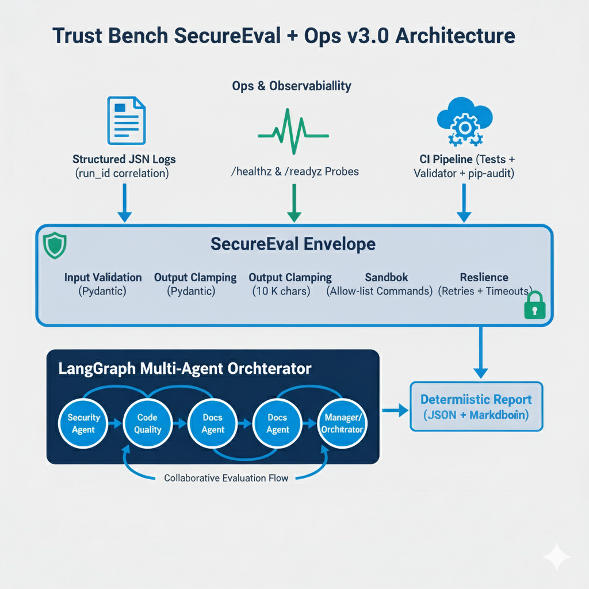

<!-- LKG SHA (production): 7a6251b -->

<div align="center">
  
</div>

<p align="center">
  <a href="https://github.com/mwill20/Trust-Bench-SecureEval-Ops/actions/workflows/python-ci.yml">
    
  </a>
  <a href="docs/evidence/coverage.txt">
    
  </a>
  <a href="https://app.readytensor.ai/publications/trust-bench-secureeval-ops-v30-production-grade-multi-agent-security-evaluation-framework-Gj5sQtaeBnZH">
    
  </a>
</p>

# Trust Bench - Multi-Agent Security Evaluation Framework

<p align="center">
  
  
</p>

## 🏗️ Architecture Overview

<div align="center">
  
  <br/>
  <em>Trust Bench v3.0 Architecture: SecureEval envelope with Ops & Observability layer</em>
</div>

### 🎥 Demo Video
Watch the full Trust Bench SecureEval + Ops demo here:  
👉 [Trust Bench v3.0 Demo (1 min 45 s)](https://1drv.ms/v/c/2c8c41c39e8a63cb/ESYtX-fABvxAiHpMaXF7EpoBE9IqpsSJRF9m9_Sisyapkg?e=u4sjhv)

*A short walkthrough showing Trust Bench SecureEval + Ops v3.0 in action — identical UI, enhanced with security guardrails, resilience, structured logs, and health probes.*

Trust Bench (Project2v2) is a LangGraph-based multi-agent workflow that inspects software repositories for security leakage, code quality gaps, and documentation health. The system features intelligent agent routing with specialized personas, cross-agent collaboration, transparent reasoning, and reproducible outputs that graders can run entirely offline.

## 🚀 Latest Features

### Phase 1: Intelligent Agent Routing ✅ Complete
### Phase 2: Ops Layer ✅ Complete
- **🧾 Structured Logging**: JSON-formatted logs with run IDs via `Project2v2/app/logging.py`
- **🩺 Health Probes**: `/healthz` and `/readyz` FastAPI routes in `Project2v2/app/health.py`
- **🔍 Observability Tests**: `pytest Project2v2/tests/test_ops_layer.py` for log formatting & health endpoints
- **📊 Documentation Updates**: OPERATIONS.md logging/health guidance, SECURITY.md redaction policy
- **📈 CI Evidence**: Coverage + validator hooks ready for pipeline integration
### Phase 0: Parity Lock-In ✅ Complete
- **🧪 Golden Fixtures**: Canonical `report.json`, `report.md`, and `bundle.zip` locked in `tests/fixtures/`
- **🛡️ Parity Tests**: `pytest Project2v2/tests/test_parity.py` verifies JSON structure, markdown digest, and bundle contents
- **📦 Artifact Freeze**: `Project2v2/output/` mirrors fixtures to guarantee identical observable behavior for future phases
- **📓 Documentation Hooks**: `OPERATIONS.md` and `SECURITY.md` populated with Phase 0 baselines to evolve alongside new features
- **🛡️ Security Agent**: Specialized vulnerability assessment and risk analysis
- **⚡ Quality Agent**: Code quality improvements and best practices guidance  
- **📚 Documentation Agent**: Documentation generation and improvement suggestions
- **🎯 Orchestrator Agent**: General queries, project overview, and multi-agent coordination
- **Smart Routing**: LLM-powered question classification with confidence scoring

### Phase 1: SecureEval Layer ✅ Complete
- **🛡️ Input Guardrails**: Pydantic validation via `Project2v2/app/security/guardrails.py`
- **🔒 Sandbox Execution**: Allowlisted subprocess wrapper (`safe_run`) preventing arbitrary shell usage
- **♻️ Resilience Decorators**: Retry with exponential backoff + cross-platform timeout wrappers
- **🧪 Safety Tests**: `pytest Project2v2/tests/test_secure_eval.py` covering validation, sandboxing, and resilience paths
- **📘 Documentation**: SECURITY.md / OPERATIONS.md updated with Phase 1 safeguards and resilience defaults
### Phase 2: Multi-Agent Consultation ✅ Complete
- **🔄 Collaborative Analysis**: Complex queries automatically trigger multiple agents
- **🎯 Multi-Agent Detection**: System identifies when specialist consultation is needed
- **📋 Executive Synthesis**: Comprehensive responses combining insights from all relevant agents
- **🤝 Cross-Domain Queries**: Handle requests spanning security, quality, and documentation
- **Intelligent Orchestration**: Seamless coordination between specialist agents

### Phase 3: Advanced Orchestration ✅ Complete
- **🤝 Consensus Building**: Agents collaborate to reach agreements on complex assessments
- **⚔️ Conflict Resolution**: Systematic resolution of conflicting agent recommendations
- **🔄 Iterative Refinement**: Multiple rounds of analysis for nuanced scenarios
- **⚖️ Priority Negotiation**: Balance competing concerns (e.g., security vs maintainability)
- **🧠 Advanced Synthesis**: Unified recommendations from complex multi-agent negotiations
- **📊 Comprehensive Analysis**: Deep, multi-perspective evaluations with consensus metrics

### Phase 4: Custom Agent Weights ✅ Complete
- **🎛️ Interactive Weight Adjustment**: Real-time sliders for Security, Quality, and Documentation agent importance
- **⚖️ Weighted Scoring System**: Final evaluation scores calculated using custom agent weightings
- **📋 Preset Configurations**: Quick-select buttons for Security Focus, Quality Focus, Documentation Focus, and Balanced approaches
- **📈 Live Score Preview**: Real-time preview of how weight changes affect final evaluation scores
- **🔧 Flexible Integration**: Works seamlessly through web interface, CLI, and API with backward compatibility

### Phase 5: Agent Confidence Scoring ✅ Complete
- **📊 Confidence Calculations**: Advanced algorithms assess agent confidence based on response completeness, specificity, and score consistency
- **🎯 Visual Confidence Meters**: Color-coded progress bars (green/yellow/red) display confidence levels for each agent analysis
- **📋 Confidence Reporting**: Confidence scores included in JSON/Markdown reports with detailed breakdowns and visual indicators
- **🔍 Smart Recommendations**: System provides insights based on confidence levels to guide users toward more reliable agent outputs
- **⚡ Real-time Display**: Live confidence updates in web interface alongside analysis results with expandable details

### Phase 6: Enhanced UI Indicators ✅ Complete
- **🎯 Consensus Journey Visualization**: Complete timeline of agent negotiations with progress markers and round-by-round analysis
- **💬 Live Negotiation Highlights**: Speech bubbles showing actual agent conversations with mood indicators (green/yellow/red)
- **⚔️ Visual Conflict Resolution**: Before/after comparison panels displaying initial disagreements vs final negotiated results
- **🔄 Interactive Process Steps**: Expandable accordion cards for each negotiation round with detailed collaboration insights
- **📊 Agent Mood Mapping**: Real-time mood badges showing agreement, negotiation, and conflict states during consensus building
- **🎭 Authentic Agent Data**: All visualizations use genuine agent conversations and collaboration data, not simulated content

### Phase 7: Enhanced Export Features ✅ Complete
- **📦 Complete Analysis Bundles**: ZIP downloads containing JSON reports, Markdown summaries, and chat transcripts in one package
- **💬 Chat Export/Import**: Save and restore conversation histories with agent routing decisions and confidence scores
- **🔄 Session Continuity**: Import previous conversations to continue analysis or share findings with team members
- **📊 Multiple Download Options**: Individual JSON/Markdown reports (legacy) plus new enhanced bundles with chat data
- **🕐 Timestamped Archives**: UTC timestamps and metadata preservation for audit trails and team collaboration
- **🛡️ Secure File Handling**: Safe path validation and proper encoding for cross-platform compatibility

## Contents
1. [Overview](#overview)
2. [Tool Integrations](#tool-integrations)
3. [Installation & Setup](#installation--setup)
4. [Running the System](#running-the-system)
5. [Evaluation Metrics Instrumentation](#evaluation-metrics-instrumentation)
6. [Reporting Outputs](#reporting-outputs)
7. [Demo Video](#demo-video)
8. [Example Results (Project2v2 self-audit)](#example-results-project2v2-self-audit)
9. [MCP Server (Scope Decision)](#mcp-server-scope-decision)
10. [File Structure (trimmed)](#file-structure-trimmed)
11. [Security & Hardening Notes](#security--hardening-notes)
12. [Documentation Roadmap & Evidence](#documentation-roadmap--evidence)
13. [Credits & References](#credits--references)

---

## Overview

- **Agents**: Manager (plan/finalize), SecurityAgent, QualityAgent, DocumentationAgent  
- **Core Tools**: regex secret scanner, repository structure analyzer, documentation reviewer  
- **Collaboration**: agents exchange messages and adjust scores based on peer findings (security alerts penalize quality/documentation; quality metrics influence documentation, etc.)  
- **Deliverables**: JSON and Markdown reports containing composite scores, agent summaries, conversation logs, and instrumentation metrics

```
[Manager Plan]
     |
[SecurityAgent] --> alerts --> [QualityAgent] --> metrics --> [DocumentationAgent]
     \____________________________ shared context _____________________________/
                           |
                   [Manager Finalize] --> report.json / report.md
```

---

## Tool Integrations

| Tool | Consumed By | Capability Extension |
|------|-------------|----------------------|
| `run_secret_scan` | SecurityAgent | Detects high-signal credentials (AWS, GitHub, RSA keys) |
| `analyze_repository_structure` | QualityAgent | Counts files, languages, estimated test coverage |
| `evaluate_documentation` | DocumentationAgent | Scores README variants by coverage and cross-agent context |
| `serialize_tool_result` | All agents | Normalizes tool dataclasses for message passing |

> MCP endpoints are intentionally **not** shipped in Project2v2. See [MCP Server (Scope Decision)](#mcp-server-scope-decision).

---

## Installation & Setup

Environment: Python 3.10+, Windows 10/11, CPU-only (no GPU required)

```powershell
git clone https://github.com/mwill20/Trust_Bench.git
cd Trust_Bench
python -m venv .venv          # optional but recommended
.\.venv\Scripts\activate
pip install -r Project2v2/requirements-phase1.txt
pip install -r Project2v2/requirements-optional.txt  # extras: ragas, semgrep, streamlit
copy Project2v2\.env_example .env                    # populate provider keys if desired
```

If you prefer to run entirely offline, leave API keys empty; all analyses will still complete deterministically.

Environment variables (for web UI / LLM chat):

- `LLM_PROVIDER` (default `openai`; options: `openai`, `groq`, `gemini`)
- `OPENAI_API_KEY`, `GROQ_API_KEY`, `GEMINI_API_KEY` (as required by provider)
- `ENABLE_SECURITY_FILTERS` (defaults to `true` for prompt/repo sanitization)

---

## Running the System

### Web Interface (recommended)

```powershell
cd Project2v2
python web_interface.py
# browse to http://localhost:5001
```

The web interface now features **intelligent agent routing** that automatically directs your questions to the most appropriate specialist agent. Ask security questions, request code quality improvements, or seek documentation help - the system will route to the right expert and provide contextual responses with visual agent indicators.

### Direct CLI

```powershell
cd Project2v2
python main.py --repo .. --output output
```

### Legacy CLI (kept for rubric compatibility)

```powershell
python -m trustbench_core.eval.evaluate_agent --repo <path> --output Project2v2/output
```

This forwards to `Project2v2/main.py`; the new entrypoint remains the single source of truth.

### Convenience Scripts

```powershell
cd Project2v2
.\run_audit.ps1 .. my_output   # PowerShell
run_audit.bat ..               # Windows CMD
launch.bat                     # Interactive menu (web UI, CLI, presets)
```

---

## Evaluation Metrics Instrumentation

Every run records deterministic metrics alongside agent results:

- **System latency** - overall wall-clock time plus per-agent/per-tool timings (`metrics.system_latency_seconds`, `metrics.per_agent_latency`)
- **Faithfulness** - heuristic alignment of summaries with tool evidence (`metrics.faithfulness`)
- **Refusal accuracy** - simulated unsafe prompt harness (returns 1.0 while LLM calls are disabled) (`metrics.refusal_accuracy`)

Metrics appear in both `report.json` (under `metrics`) and `report.md` (rendered table). Example CLI output:

```
System Latency: 0.08 seconds
Faithfulness: 0.62
Refusal Accuracy: 1.0
Per-Agent Timings:
  - SecurityAgent: 0.07 seconds
  - QualityAgent: 0.003 seconds
  - DocumentationAgent: 0.002 seconds
```

---

## Reporting Outputs

Each audit (web or CLI) produces:

- `report.json` - timestamp, repo path, composite summary, per-agent results, metrics, full conversation log  
- `report.md` - human-readable summary with agent cards, instrumentation metrics, conversation log  
- Optional timestamped archives (`github_analysis_*`) when launched through the web interface

---

## Demo Video

<div align="center">
  <video controls width="640" poster="Project2v2/assets/images/TrustBench.png">
    <source src="https://1drv.ms/v/c/2c8c41c39e8a63cb/EQil7I1iewdEuzPdQGBqVOYBHaRg9tBcyogZvmKUXKFLyw?e=8Dl8P5" type="video/mp4" />
    Your browser does not support the video tag. You can download the walkthrough
    <a href="https://1drv.ms/v/c/2c8c41c39e8a63cb/EQil7I1iewdEuzPdQGBqVOYBHaRg9tBcyogZvmKUXKFLyw?e=8Dl8P5">here</a>.
  </video>
</div>

_If playback doesn't work on GitHub, download the file locally from the same link above._

> The full-resolution video is hosted via OneDrive to keep the repository history lean. If you want an offline copy, download it from the link above and place it under `Project2v2/assets/images/`.

---

## Example Results (Project2v2 self-audit)

- Overall Score: ~32/100 (`needs_attention`)  
- Security: seeded secrets detected (score 0) drive collaboration penalties  
- Quality: medium score, automatically penalized by SecurityAgent findings  
- Documentation: strong base score but reduced for missing security/testing guidance  
- Collaboration: more than five cross-agent messages; Manager summarizes adjustments in the final log

---

## MCP Server (Scope Decision)

Project2v2 prioritizes deterministic, offline-capable tooling. To keep grading reproducible and avoid external runtime dependencies, the earlier MCP server has been **intentionally deprecated** for this version. Required tool integrations (three or more) are provided as direct Python callables. MCP can be revisited later if cross-client interoperability (Claude Desktop, Cursor, etc.) becomes necessary, but it is **not required** for Module 2 compliance.

---

## File Structure (trimmed)

```
Trust_Bench/
|-- Project2v2/
|   |-- main.py
|   |-- web_interface.py
|   |-- multi_agent_system/
|   |   |-- agents.py
|   |   |-- orchestrator.py
|   |   |-- tools.py
|   |   `-- reporting.py
|   |-- requirements-phase1.txt
|   |-- requirements-optional.txt
|   |-- run_audit.(bat|ps1)
|   |-- launch.bat
|   `-- output/
|-- trustbench_core/      (legacy CLI wrapper forwarding to Project2v2/main.py)
`-- Project2v2/checklist.yaml (optional-features register)
```

---

## Security & Hardening Notes

- All detected secrets are synthetic and included solely for demonstration purposes. No real credentials are exposed.
- `security_utils.py` and the web UI sanitize repository URLs, prompts, and API keys.
- Optional extras (`ragas`, `semgrep`, `streamlit`) enable deeper analytics and dashboarding when desired.

---

## Future Work & Enhancements

The following features are planned for future releases:

### Future Considerations (Lower Priority)
- **Batch Analysis**: Automated analysis of multiple repositories simultaneously with queue management and comparative dashboards
  - *Note: This feature requires significant infrastructure (job queuing, background workers, database) and is planned for a later major release*

### Long-term Vision
- Additional specialized agents (Performance, Accessibility, Compliance)
- Integration with CI/CD pipelines
- Real-time repository monitoring
- Advanced analytics and trending

---

## Documentation Roadmap & Evidence

To satisfy Project 3 publication requirements, the repository ships with dedicated documentation artifacts. Keep these synchronized with feature development:

| Document | Purpose | Status / Next Action |
| --- | --- | --- |
| [`README.md`](README.md) | Executive summary, architecture overview, quickstart, CI/coverage references | ✅ Actively maintained |
| [`OPERATIONS.md`](Project2v2/OPERATIONS.md) | Operational excellence rubric (start/stop/health, logging, resilience, monitoring) | 📝 Skeleton ready – fill details as services evolve |
| [`SECURITY.md`](Project2v2/SECURITY.md) | Security & safety rubric (input validation, guardrails, sandbox, SOC 2-lite map) | 📝 Skeleton ready – update per guardrail implementation |
| [`USER_GUIDE.md`](Project2v2/USER_GUIDE.md) | End-user walkthrough + context | ✅ Append “Production Enhancements” notes when Phase 0 work lands |
| `docs/evidence/` (optional) | Test/coverage screenshots, CI logs for publication attachments | 🔄 Create as artifacts are generated |

**Working agreement:**  
- Phase 0 (“Parity Lock-In”) adds test coverage notes under README → Testing & CI Summary, and populates the open TODOs in `OPERATIONS.md` / `SECURITY.md`.  
- Each subsequent phase should update the relevant section(s) before closing the task to avoid drift.

---

## Production Enhancements (Module 3)

Phase 3 and 4 harden the system for publication while preserving identical UX:

- CI gate (`python-ci` workflow) runs tests, coverage, security audit, and rubric validator on every PR.
- Structured JSON logs, health probes, and resilience settings documented in [OPERATIONS.md](Project2v2/OPERATIONS.md).
- Security controls (input validation, sandbox, redaction, SOC 2-lite mapping) captured in [SECURITY.md](Project2v2/SECURITY.md).
- Evidence bundle placeholders live under [Project2v2/docs/evidence/](Project2v2/docs/evidence/) for publishing artifacts (CI proof, screenshots, coverage report).
## Credits & References

- Ready Tensor AI Agent Course - Module 2 (Multi-Agent Evaluation)  
- LangGraph, CrewAI, AutoGen (collaboration inspiration)  
- Semgrep, OpenAI/Groq/Gemini APIs (referenced integrations)  
- Project2v2 implementation by @mwill20 and collaborators

_Version Project2v2 - October 2025 - Refactored for offline deterministic evaluation._
