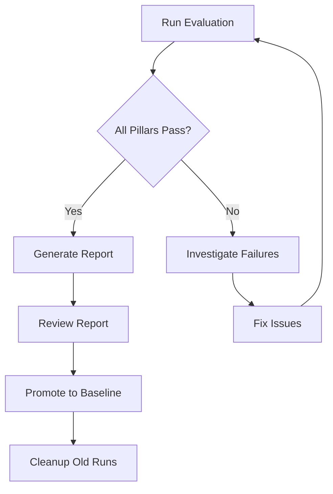

# TrustBench Studio User Guide

## Button Features & Workflows

**Version**: 1.0  
**Last Updated**: October 14, 2025

---

## Table of Contents

1. [Generate Report](#1-generate-report-)
2. [Cleanup Workspace](#2-cleanup-workspace-)
3. [Promote to Baseline](#3-promote-to-baseline-)
4. [Best Practices](#best-practices)
5. [Troubleshooting](#troubleshooting)

---

## 1. Generate Report 📊

### What It Does

Creates a comprehensive evaluation report in Markdown and HTML formats, containing all metrics, charts, and recommendations from your latest evaluation run.

### When to Use

- **After a successful evaluation** to document results
- **For stakeholder meetings** to share findings
- **For compliance/audit trails** to maintain records
- **Before making changes** to establish a baseline reference

### How to Use

#### Step 1: Run an Evaluation

```bash
python run_eval_direct.py
```

Wait for all 4 pillars (Athena, Helios, Aegis, Eidos) to complete.

#### Step 2: Click "Generate Report"

1. Navigate to TrustBench Studio (`http://localhost:3000`)
2. Scroll to the footer (bottom of the page)
3. Click the **"Generate Report"** button (gray button)
4. Watch the logs panel for confirmation

#### Step 3: Access Your Report

Reports are saved to:

```
trustbench_core/eval/runs/latest/
├── report.md     ← Markdown version
└── report.html   ← HTML version (if markdown2 installed)
```

### What's Included in the Report

#### Executive Summary

- Overall pass/fail status
- Composite score across all pillars
- Quick metrics table

#### Detailed Metrics

- **Athena (Task Fidelity)**: Faithfulness score, LLM provider, scoring method
- **Helios (System Performance)**: Latencies (mean, P95), response times
- **Aegis (Security)**: Injection block rate, secret findings, code vulnerabilities
- **Eidos (Ethics)**: Refusal accuracy, policy compliance

#### Recommendations

- Actionable insights based on your metrics
- Suggestions for improvement
- Next steps

#### Technical Details

- Configuration used
- Git SHA for traceability
- Scoring methodology

### Example Output

```markdown
# TrustBench Evaluation Report

**Generated**: 2025-10-14 15:30:00
**Git SHA**: `c2cc7e8`
**Profile**: default

## Executive Summary

### Overall Status: ✅ PASS

| Pillar               | Metric           | Value  | Status |
| -------------------- | ---------------- | ------ | ------ |
| **Athena** (Task)    | Faithfulness     | 0.697  | ✅     |
| **Helios** (System)  | Mean Latency     | 0.295s | ✅     |
| **Aegis** (Security) | Injection Block  | 100%   | ✅     |
| **Eidos** (Ethics)   | Refusal Accuracy | 100%   | ✅     |

...
```

### Tips

- **HTML reports** require `markdown2`: `pip install markdown2`
- **Share reports** by opening the HTML file in a browser
- **Version control**: Reports include Git SHA for traceability
- **Customize**: Edit `scripts/generate_report.py` to add custom sections

---

## 2. Cleanup Workspace 🧹

### What It Does

Archives old evaluation runs and removes temporary files to free up disk space while keeping recent runs and the baseline safe.

### When to Use

- **Disk space running low** on your machine
- **Before important evaluations** to start with a clean slate
- **Periodically** (e.g., monthly) for housekeeping
- **After uploading sensitive repos** to remove cached data

### How to Use

#### Step 1: Click "Cleanup Workspace"

1. Navigate to TrustBench Studio (`http://localhost:3000`)
2. Click the **"Cleanup Workspace"** button (green button)
3. A confirmation dialog appears:

   ```
   Archive old evaluation runs and clean up temporary files?

   This will keep the 10 most recent runs and the baseline.
   ```

4. Click **OK** to proceed or **Cancel** to abort

#### Step 2: Review Results

Check the logs panel for cleanup summary:

- Number of runs archived
- Amount of disk space freed
- Location of archived files

### What Gets Cleaned

#### Archived (Moved to `runs/archive/`)

- Evaluation runs older than the 10 most recent
- Timestamped for future reference
- Can be restored manually if needed

#### Deleted

- Python cache files (`__pycache__`, `*.pyc`)
- Pytest cache (`.pytest_cache`)
- Log files (`*.log`)
- Other temporary files

#### Protected (Never Deleted)

✅ `runs/latest/` - Current evaluation  
✅ `runs/baseline/` - Your golden standard  
✅ 10 most recent runs  
✅ Source code and scripts  
✅ Configuration files

### Example Output

```
🧹 Starting TrustBench Workspace Cleanup...

📂 Scanning evaluation runs (keeping 10 most recent)...
  Found 15 run(s)
  Archiving 5 old run(s)...
  📦 Archived: run_20251010_143022 → archive/run_20251010_143022_20251014_153000
  📦 Archived: run_20251009_102514 → archive/run_20251009_102514_20251014_153001
  ...

🗑️  Cleaning up temporary files...
  ✅ Cleaned: 45.23 MB

✅ Cleanup Complete!

📊 Summary:
  • Kept recent runs: 10
  • Archived old runs: 5
  • Total space freed: 123.45 MB

📁 Archive location: trustbench_core/eval/runs/archive
```

### Tips

- **Restore archived runs**: Simply move them back from `archive/` to `runs/`
- **Adjust retention**: Edit `KEEP_RECENT_RUNS` in `scripts/cleanup_workspace.py`
- **Before cleanup**: Generate reports for runs you want to keep
- **Safe operation**: Confirmation dialog prevents accidental deletion

---

## 3. Promote to Baseline ⭐

### What It Does

Saves the current evaluation as your "golden standard" baseline. Future evaluations will compare against this baseline to detect performance regressions or improvements.

### When to Use

- **After a successful evaluation** that you're proud of
- **Before deploying to production** to establish a quality bar
- **After fixing issues** to set a new reference point
- **Sprint/release milestones** to track progress over time

### How to Use

#### Step 1: Run a Good Evaluation

Ensure your current evaluation meets your quality standards:

- All pillars passing ✅
- Metrics within acceptable ranges
- Representative of production workload

#### Step 2: Click "Promote to Baseline"

1. Navigate to TrustBench Studio (`http://localhost:3000`)
2. Click the **"Promote to Baseline"** button (blue button)
3. A confirmation dialog appears:

   ```
   Save the current evaluation as the golden standard baseline?

   Future runs will compare against this baseline.
   ```

4. Click **OK** to proceed

#### Step 3: Verify Baseline Created

Check that baseline exists:

```bash
ls trustbench_core/eval/runs/baseline/
```

You should see:

```
trustbench_core/eval/runs/baseline/
├── metrics.json       ← Baseline metrics
├── metadata.json      ← Promotion timestamp and notes
├── gate.json          ← Pass/fail by pillar
├── run.json           ← Run configuration
└── ...
```

### What Gets Saved

The entire evaluation run is copied to `runs/baseline/`:

- **All metrics** (faithfulness, latency, security, ethics)
- **Configuration** (profile, thresholds, LLM provider)
- **Metadata** (timestamp, Git SHA, promotion note)
- **Raw data** (test samples, failures, detailed logs)

### Comparing Against Baseline

After promoting a baseline, future evaluations will show:

- **Delta metrics**: How much better/worse than baseline
- **Regression alerts**: If performance drops
- **Improvement tracking**: Progress over time

Example comparison:

```
Athena Faithfulness: 0.72 (↑ +3.5% from baseline 0.70)
Helios Mean Latency: 0.31s (↓ -5.2% from baseline 0.29s - REGRESSION!)
Aegis Injection Block: 1.00 (= same as baseline)
```

### Multiple Baselines Strategy

For advanced users, consider maintaining multiple baselines:

#### Per Environment

```
runs/baseline-dev/
runs/baseline-staging/
runs/baseline-production/
```

#### Per Feature/Branch

```
runs/baseline-feature-auth/
runs/baseline-feature-search/
runs/baseline-main/
```

To implement, manually copy runs to custom baseline directories.

### Tips

- **Update regularly**: Re-promote baseline after significant improvements
- **Document changes**: Add notes explaining why you promoted
- **Track history**: Keep old baselines in `archive/` for reference
- **CI/CD integration**: Automate baseline comparison in pipelines

---

## Best Practices

### Evaluation Workflow



### Recommended Cadence

#### Daily Development

1. Run evaluation after code changes
2. Compare against baseline
3. If better → consider promoting

#### Weekly Maintenance

1. Generate report for sprint review
2. Promote baseline if stable
3. Cleanup workspace

#### Monthly Housekeeping

1. Review archived runs
2. Delete very old archives (>3 months)
3. Update baselines per environment

### Disk Space Management

#### Small Projects (<1GB)

- Keep 10 recent runs
- Cleanup monthly

#### Medium Projects (1-10GB)

- Keep 5 recent runs
- Cleanup weekly

#### Large Projects (>10GB)

- Keep 3 recent runs
- Cleanup after each evaluation

### Report Sharing

#### For Technical Teams

Share **Markdown reports** (`.md`) for easy version control and diffs.

#### For Management/Stakeholders

Share **HTML reports** (`.html`) - more visually appealing, opens in browser.

#### For Audits/Compliance

Generate and archive reports with Git SHA for full traceability.

---

## Troubleshooting

### Generate Report Issues

#### Problem: "Report generation script not found"

**Solution**:

```bash
# Verify script exists
ls scripts/generate_report.py

# If missing, restore from Git
git checkout scripts/generate_report.py
```

#### Problem: "No metrics found"

**Solution**:

```bash
# Run an evaluation first
python run_eval_direct.py

# Verify metrics exist
cat trustbench_core/eval/runs/latest/metrics.json
```

#### Problem: "HTML report not generated"

**Solution**:

```bash
# Install markdown2
pip install markdown2

# Regenerate report
python scripts/generate_report.py
```

### Cleanup Workspace Issues

#### Problem: "Permission denied" errors

**Solution**:

```bash
# On Windows, close any processes using the files
# Check if backend is holding files open
netstat -ano | findstr "8000"

# On Linux/Mac, ensure you have write permissions
chmod -R u+w trustbench_core/eval/runs/
```

#### Problem: "Cleanup removed too many runs"

**Solution**:

```bash
# Restore from archive
cp -r trustbench_core/eval/runs/archive/run_TIMESTAMP trustbench_core/eval/runs/

# Adjust retention in script
# Edit scripts/cleanup_workspace.py
# Change: KEEP_RECENT_RUNS = 10  # Increase this number
```

### Promote to Baseline Issues

#### Problem: "Baseline script not found"

**Solution**:

```bash
# Verify script exists
ls scripts/make_baseline.py

# If missing, check if it's in a different location
find . -name "make_baseline.py"
```

#### Problem: "Baseline promotion succeeded but no comparison"

**Note**: Baseline comparison is a future feature. Currently, baseline is saved but comparison logic needs to be implemented in the orchestrator.

### General Issues

#### Problem: Backend not responding

**Solution**:

```bash
# Check if backend is running
curl http://localhost:8000/api/health

# If not, start it
cd trust_bench_studio
python -m api.server
```

#### Problem: Buttons not clickable

**Solution**:

1. Refresh the browser (`Ctrl+R` or `Cmd+R`)
2. Check browser console for errors (`F12` → Console)
3. Verify frontend is running on `http://localhost:3000`

#### Problem: Logs not showing

**Solution**:

- Click on agent nodes to open their detail panels
- Check the "System Logs" section in the sidebar
- Verify `logs` state is being updated (check React DevTools)

---

## API Reference

For developers integrating with TrustBench programmatically:

### Generate Report

```bash
curl -X POST http://localhost:8000/api/report/generate
```

Response:

```json
{
  "status": "ok",
  "message": "✅ Report saved to: trustbench_core/eval/runs/latest/report.md"
}
```

### Cleanup Workspace

```bash
curl -X POST http://localhost:8000/api/workspace/cleanup
```

Response:

```json
{
  "status": "ok",
  "message": "✅ Cleanup Complete! Total space freed: 123.45 MB"
}
```

### Promote to Baseline

```bash
curl -X POST http://localhost:8000/api/baseline/promote \
  -H "Content-Type: application/json" \
  -d '{"note": "Stable release v1.2.0"}'
```

Response:

```json
{
  "status": "ok",
  "stdout": "Baseline promoted successfully"
}
```

---

## Keyboard Shortcuts (Future)

_Coming soon_:

- `Ctrl+R` / `Cmd+R` - Generate Report
- `Ctrl+K` / `Cmd+K` - Cleanup Workspace
- `Ctrl+B` / `Cmd+B` - Promote to Baseline

---

## FAQ

### Q: How often should I promote to baseline?

**A**: Whenever you have a stable evaluation that represents your desired quality level. Typically after major improvements or before deployments.

### Q: Can I have multiple baselines?

**A**: The UI supports one baseline, but you can manually maintain multiple by copying `runs/baseline/` to custom directories like `runs/baseline-prod/`.

### Q: Will cleanup delete my source code?

**A**: No! Cleanup only touches the `runs/` directory and temp files. Your source code in `trustbench_core/agents/`, `scripts/`, etc. is never touched.

### Q: Can I undo a cleanup?

**A**: Archived runs are moved to `runs/archive/` and can be restored manually. Deleted temp files (like `__pycache__`) cannot be recovered but are regenerated automatically.

### Q: How do I share a report with someone who doesn't have TrustBench?

**A**: Generate the report, then share the HTML file (`report.html`). They can open it in any web browser without needing TrustBench installed.

### Q: What's the difference between "latest" and "baseline"?

**A**: `latest` is your most recent evaluation (changes with every run). `baseline` is your golden standard (only changes when you promote).

---

## Support

- **Documentation**: See `docs/` directory
- **Issues**: [GitHub Issues](https://github.com/mwill20/Trust_Bench/issues)
- **System Logs**: Check `SYSTEM_LOGS_ANALYSIS.md`

---

_TrustBench Studio - AI Safety Evaluation Made Simple_ 🚀
